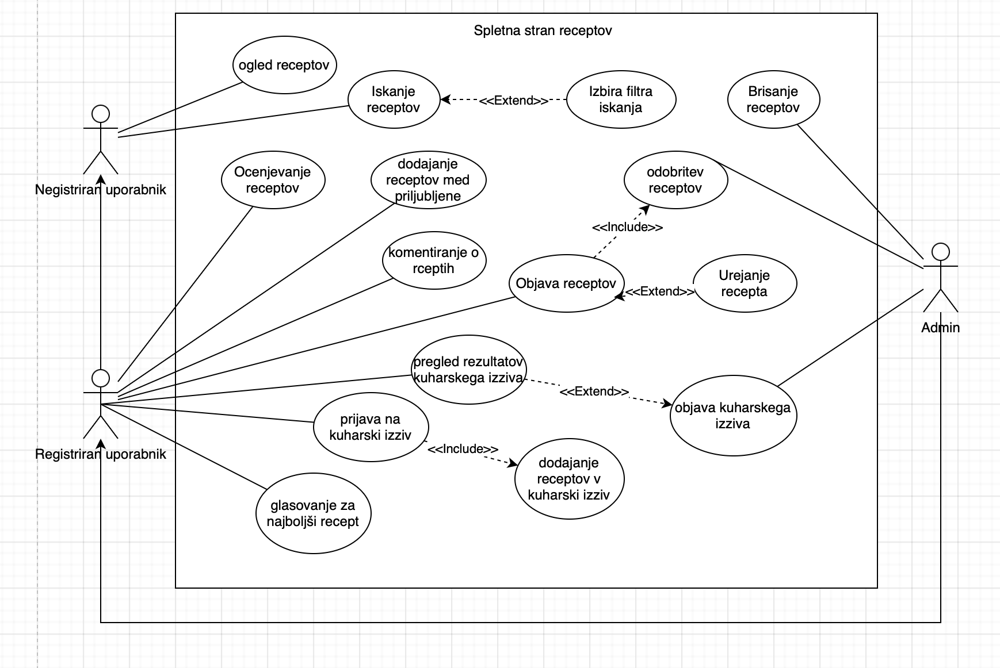

# Naziv projekta
Spletna stran z recepti

## Skupina: Bitne Princeske
### Člani: Neja, Anastasiya, Stanislav

## Kazalo

- [O projektu](#o-projektu)
- [Vizija projekta](#vizija-projekta)
- [Besednjak](#besednjak)
- [Uporabljene tehnologije](#uporabljene-tehnologije)
- [Struktura projekta](#struktura-projekta)
- [Za začetek](#za-začetek)
- [Kaj potrebujete](#kaj-potrebujete)
- [inštalacija](#inštalacija)
- [Zagon aplikacije](#zagon-aplikacije)
- [Testiranje](#testiranje)
- [Kontribucija](#kontribucija)
- [Licenca](#licenca)
- [Diagram primera uporabe](#diagram-primera-uporabe)
- [Scenarij](#scenarij)

## O projektu
Aplikacija Moji Recepti je preprosta spletna stran za deljenje in iskanje receptov, namenjena kuharjem, ljubiteljem kulinarike in vsem, ki radi pripravljajo jedi doma. Uporabnikom omogoča preprost način za iskanje receptov po kategorijah, objavljanje lastnih receptov in dodajanje svojih priljubljenih receptov na seznam za kasnejšo uporabo. Zasnovana je kot platforma, kjer lahko uporabniki delijo kulinarične nasvete, ocenjujejo recepte in izmenjujejo ideje.

## Vizija projekta

VIZIJA PROJEKTA
Namen: Spletna aplikacija za recepte bo uporabnikom omogočala enostaven in intuitiven dostop do široke zbirke kuharskih receptov. Z aplikacijo želimo uporabnikom zagotoviti priročen način za raziskovanje novih kulinaričnih idej, vodenje skozi pripravo jedi in personalizacijo receptov glede na njihove prehranske preference in razpoložljive sestavine.

Cilji: Naš cilj je uporabnikom ponuditi centralizirano platformo, ki ne le izboljša njihovo kuharsko izkušnjo, temveč tudi optimizira čas, potreben za načrtovanje obrokov in iskanje receptov. Aplikacija bo vključevala funkcionalnosti za iskanje po kategorijah, shranjevanje priljubljenih receptov, personalizirane priporočila in možnost dodajanja lastnih prilagoditev ali opomb k receptom.

Aplikacija je namenjena ljubiteljem kuhanja vseh starosti, od začetnikov do izkušenih kuharjev, ki iščejo navdih ali želijo izboljšati svoje kuharske veščine. Prav tako je idealna za tiste z omejenim časom, ki bi radi hitro našli ustrezne recepte na osnovi razpoložljivih sestavin ali specifičnih prehranskih potreb.
Z našo aplikacijo uporabnikom omogočamo dostop do personaliziranih kuharskih rešitev, kar prispeva k zmanjšanju stresa pri načrtovanju obrokov, izboljšanju organizacije kuhanja ter večji angažiranosti uporabnikov, saj si lahko ustvarijo svoj nabor priljubljenih receptov. S tem želimo izboljšati celotno izkušnjo kuhanja – od ideje do izvedbe.

## Besednjak

1.Recept
  Natančen opis priprave določene jedi, ki vključuje sestavine, korake za pripravo in pogosto tudi čas kuhanja ali pečenja.

2.Sestavine
  Seznam potrebnih živil in količin, ki so potrebne za pripravo določenega recepta.

3.Priljubljeni recepti
  Recepti, ki jih uporabnik shrani kot priljubljene, da ima hiter dostop do njih za kasnejšo uporabo.

4.Iskanje po sestavinah
  Funkcionalnost, ki uporabnikom omogoča iskanje receptov glede na specifične sestavine, ki jih imajo na voljo.

5.Prehranske preference
  Nastavitve uporabnikov glede prehranskih omejitev, kot so vegetarijanstvo, veganstvo, brezglutenske diete ipd.

6.Koraki priprave
  Navodila po korakih, ki opisujejo način in vrstni red priprave jedi.

7.Kategorije receptov
  Razdelki za organizacijo receptov, npr. po vrsti jedi (predjed, glavna jed, sladica), času priprave ali sestavinah.

8.Čas priprave
  Čas, ki je potreben za pripravo določene jedi od začetka do konca.

## Uporabljene tehnologije
- Spring Boot backend
- Node.js frontend

## Struktura projekta

/recepti
├── /frontend          # Node.js frontend application
└── /backend           # Spring Boot backend application

## Za začetek
Ta navodila vam bodo pomagali pri namestitvi in zagonu našega projekta na vašem računalniku.

## Kaj potrebujete
- JDK 17 or higher
- Node.js 
- MySQL Server
- Maven (za backend)

## Inštalacija

1. Klonirajte Git-repozitorij

git clone https://github.com/nejakasman/Recepti.git

2. Usposobite back-end

v terminalu v mapi projekta: cd backend
ustvarite mySQL podatkovno bazo in jo prilagodite projektu, konfigurirajte nastavitve v src/main/resources/application.properties

3. Build-ajte backend z ukazom v terminalu: mvn clean install

4. Premaknite se v mapo frontend: cd ../frontend

5. inštalirajte vse potrebne pakete z ukazom: npm install

 ## Zagon aplikacije
 1. Frontend
V mapi projekta v teminalu poženite dva ukaza:
 - cd frontend 
 - node server.js

 2. Backend
 v terminalu:
 - cd backend
 - mvn spring-boot:run

## Testiranje
 1. Backend
mvn test
 2. Frontend
 npm test

## Kontribucija

 Če imate željo prispevati k projektu! Sledite tem korakom za prispevanje:

Forknite repozitorij.
Ustvarite novo vejo za vašo funkcionalnost ali odpravo napake.
Opravite potrebne spremembe in jih shranite.
Potisnite svojo vejo in pošljite pull request.

## Licenca

This project is licensed under the terms of the MIT license.

## Diagram primera uporabe 

## Scenarij

1. Ogled receptov: Uporabnik si lahko ogleda podrobnosti izbranih receptov, vključno z njihovimi sestavinami in navodili za pripravo.
2. Iskanje receptov: Uporabnik lahko išče recepte po različnih kriterijih. 
3. Izbira filtra iskanja: Ta funkcionalnost razširja osnovno iskanje, tako da uporabnik lahko filtrira rezultate iskanja glede na sestavine, čas priprave, ocene itd.
4. Komentiranje o receptih: Uporabnik lahko deli svoje mnenje in nasvete z drugimi uporabniki.
5. Ocenjevanje receptov: Uporabnik lahko oceni recepte, kar pomaga drugim uporabnikom pri iskanju kakovostnih receptov.
6. Objava receptov: Uporabnik lahko deli svoje lastne recepte.
7. Urejanje receptov: Uporabnik lahko po potrebi ureja svoje recepte pred deljenjem ali kasneje.
8. Dodajanje receptov med priljubljene: Uporabnik lahko doda posamezne recepte med priljubljene, kjer so lažje dostopni.
9. Odobritev receptov: Administrator pregleda in odobrava ali zavrača nove recepte, ki jih predložijo registrirani uporabniki, s čimer zagotavlja, da so recepti kakovostni in primerne vsebine.
10. Brisanje receptov: administrator lahko izbriše recept, če ta ni primeren ali nepopolen.
 

| **Primer uporabe:**  Ogled receptov | **ID:** 1  |
|---------------------------------|--------------------------------------------------------------|
| **Cilj**                        | Omogočiti ogled receptov na spletni strani vsem uporabnikom. |
| **Akterji**                     | Neregistriran uporabnik, registriran uporabnik, admin        |
| **Predpogoji**                  | Uporabnik ima dostop do spletne strani in obstajajo recepti v bazi podatkov. |
| **Stanje sistema po PU**        | Uporabnik vidi seznam receptov in lahko izbere posamezen recept za ogled podrobnosti. |
| **Scenarij**                    |                                                              |
| 1.                              | Uporabnik (ne glede na status) odpre spletno stran z recepti. |
| 2.                              | Sistem prikaže seznam vseh razpoložljivih receptov.          |
| 3.                              | Uporabnik klikne na določen recept za ogled podrobnosti.     |
| 4.                              | Sistem prikaže podrobnosti izbranega recepta, vključno s sestavinami in postopkom priprave. |
| **Alternativni tokovi**         |                                                              |
| 1.                              | Če ni receptov v bazi, sistem prikaže sporočilo "Ni razpoložljivih receptov". |
| **Izjeme**                      |                                                              |
| 1.                              | Napaka pri nalaganju podatkov iz baze - sistem prikaže sporočilo o napaki in predlaga ponovno nalaganje strani. |

| **Primer uporabe:**  Iskanje receptov| **ID:** 2  |
|---------------------------------|--------------------------------------------------------------|
| **Cilj**                        | Uporabniku omogočiti iskanje receptov na spletni strani glede na ključne besede. |
| **Primarni akterji**            | Neregistriran uporabnik, registriran uporabnik |
| **Sekundarni akterji**          | Sistem |
| **Predpogoji**                  | Uporabnik ima dostop do spletne strani in obstajajo recepti v bazi podatkov. |
| **Stanje sistema po PU**        | Sistem prikaže seznam receptov, ki ustrezajo iskalnemu kriteriju. |
| **Scenarij**                    | |
| 1.                              | Uporabnik vnese iskalno besedo v iskalno polje. |
| 2.                              | Sistem obdeluje iskalno poizvedbo in išče ustrezne recepte v bazi podatkov. |
| 3.                              | Sistem prikaže seznam receptov, ki ustrezajo iskalnemu kriteriju. |
| 4.                              | Uporabnik lahko izbere določen recept za ogled podrobnosti. |
| **Alternativni tokovi**         | |
| 1.                              | Če sistem ne najde nobenih receptov, prikaže sporočilo "Ni najdenih receptov". |
| **Izjeme**                      | |
| 1.                              | Napaka pri iskanju podatkov - sistem prikaže sporočilo o napaki in predlaga ponovno iskanje. |

| **Primer uporabe:**  Izbira filtra iskanja| **ID:** 3  |
|---------------------------------|--------------------------------------------------------------|
| **Cilj**                        | Uporabniku omogočiti izbiro filtrov za natančnejše iskanje receptov. |
| **Primarni akterji**            | Registriran uporabnik, neregistriran uporabnik |
| **Sekundarni akterji**          | Sistem |
| **Predpogoji**                  | Uporabnik je na strani za iskanje receptov. Baza podatkov vsebuje različne recepte s pripadajočimi lastnostmi (npr. kategorija, čas priprave). |
| **Stanje sistema po PU**        | Sistem prikaže seznam receptov, ki ustrezajo izbranim filtrom iskanja. |
| **Scenarij**                    | |
| 1.                              | Uporabnik odpre stran z možnostmi iskanja receptov. |
| 2.                              | Uporabnik izbere filtre iskanja (npr. kategorija, čas priprave, sestavine). |
| 3.                              | Sistem uporabi izbrane filtre in poišče ustrezne recepte v bazi podatkov. |
| 4.                              | Sistem prikaže seznam receptov, ki ustrezajo izbranim filtrom. |
| 5.                              | Uporabnik lahko izbere določen recept za ogled podrobnosti. |
| **Alternativni tokovi**         | |
| 1.                              | Če uporabnik ne izbere nobenih filtrov, sistem prikaže vse razpoložljive recepte. |
| 2.                              | Če sistem ne najde nobenih receptov, prikaže sporočilo "Ni najdenih receptov". |
| **Izjeme**                      | |
| 1.                              | Napaka pri uporabi filtrov - sistem prikaže sporočilo o napaki in predlaga ponovno izbiro filtrov. |

| **Primer uporabe:**  Objava receptov| **ID:** 4  |
|---------------------------------|--------------------------------------------------------------|
| **Cilj**                        | Omogočiti registriranim uporabnikom, da objavijo nove recepte, ki jih mora pred objavo odobriti admin. |
| **Primarni akterji**            | Registriran uporabnik |
| **Sekundarni akterji**          | Admin |
| **Predpogoji**                  | Uporabnik je registriran in prijavljen v sistem. |
| **Stanje sistema po PU**        | Recept je odobren s strani admina in je javno objavljen na spletni strani. |
| **Scenarij**                    |  |
| 1.                              | Registriran uporabnik odpre stran za dodajanje novega recepta. |
| 2.                              | Uporabnik vnese podatke o receptu, vključno z naslovom, opisom, sestavinami in navodili za pripravo. |
| 3.                              | Uporabnik klikne na gumb "Objavi". |
| 4.                              | Sistem shrani recept v bazo podatkov s statusom "Čaka na odobritev". |
| 5.                              | Admin prejme obvestilo o novem receptu, ki čaka na odobritev. |
| 6.                              | Admin pregleda recept in ga odobri ali zavrne. |
| 7a.                             | **[Odobritev]**: Sistem spremeni status recepta na "Odobren" in ga prikaže na seznamu razpoložljivih receptov. |
| 7b.                             | **[Zavrnitev]**: Sistem spremeni status recepta na "Zavrnjen" in o tem obvesti uporabnika z razlogom zavrnitve. |
| **Alternativni tokovi**         | |
| 1.                              | Če uporabnik ne izpolni vseh obveznih polj, sistem prikaže opozorilo in zahteva dopolnitev manjkajočih podatkov. |
| **Izjeme**                      | |
| 1.                              | Napaka pri shranjevanju podatkov v bazo - sistem prikaže sporočilo o napaki in predlaga ponovno poskus objave. |
| 2.                              | Admin ne odobri recepta zaradi neprimerne vsebine - uporabnik prejme obvestilo z razlogom zavrnitve. |
