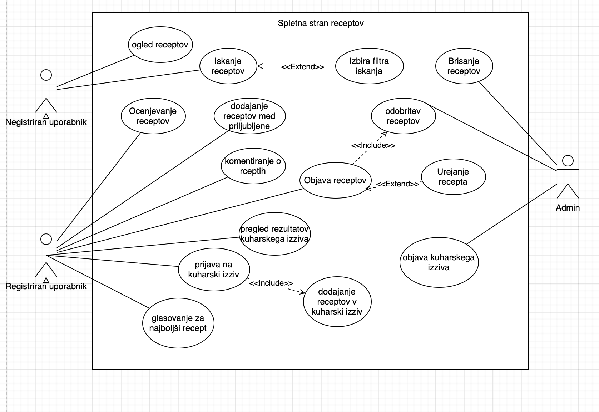
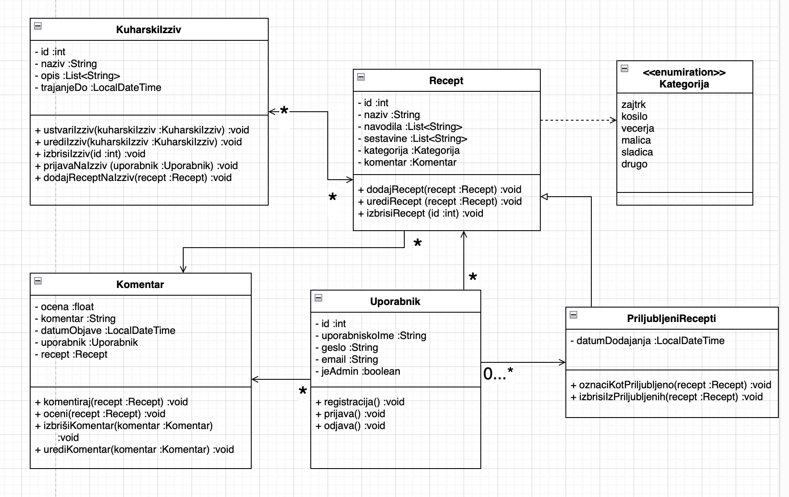

# Naziv projekta
Spletna stran z recepti

## Skupina: Bitne Princeske
### Člani: Neja, Anastasiya, Stanislav

## Kazalo

- [O projektu](#o-projektu)
- [Vizija projekta](#vizija-projekta)
- [Besednjak](#besednjak)
- [Uporabljene tehnologije](#uporabljene-tehnologije)
- [Struktura projekta](#struktura-projekta)
- [Za začetek](#za-začetek)
- [Kaj potrebujete](#kaj-potrebujete)
- [inštalacija](#inštalacija)
- [Zagon aplikacije](#zagon-aplikacije)
- [Testiranje](#testiranje)
- [Kontribucija](#kontribucija)
- [Licenca](#licenca)
- [Diagram primera uporabe](#diagram-primera-uporabe)
- [Scenarij](#scenarij)
- [Razredni diagram](#razredni-diagram)

## O projektu
Aplikacija Moji Recepti je preprosta spletna stran za deljenje in iskanje receptov, namenjena kuharjem, ljubiteljem kulinarike in vsem, ki radi pripravljajo jedi doma. Uporabnikom omogoča preprost način za iskanje receptov po kategorijah, objavljanje lastnih receptov in dodajanje svojih priljubljenih receptov na seznam za kasnejšo uporabo. Zasnovana je kot platforma, kjer lahko uporabniki delijo kulinarične nasvete, ocenjujejo recepte in izmenjujejo ideje.

## Vizija projekta

VIZIJA PROJEKTA
Namen: Spletna aplikacija za recepte bo uporabnikom omogočala enostaven in intuitiven dostop do široke zbirke kuharskih receptov. Z aplikacijo želimo uporabnikom zagotoviti priročen način za raziskovanje novih kulinaričnih idej, vodenje skozi pripravo jedi in personalizacijo receptov glede na njihove prehranske preference in razpoložljive sestavine.

Cilji: Naš cilj je uporabnikom ponuditi centralizirano platformo, ki ne le izboljša njihovo kuharsko izkušnjo, temveč tudi optimizira čas, potreben za načrtovanje obrokov in iskanje receptov. Aplikacija bo vključevala funkcionalnosti za iskanje po kategorijah, shranjevanje priljubljenih receptov, personalizirane priporočila in možnost dodajanja lastnih prilagoditev ali opomb k receptom.

Aplikacija je namenjena ljubiteljem kuhanja vseh starosti, od začetnikov do izkušenih kuharjev, ki iščejo navdih ali želijo izboljšati svoje kuharske veščine. Prav tako je idealna za tiste z omejenim časom, ki bi radi hitro našli ustrezne recepte na osnovi razpoložljivih sestavin ali specifičnih prehranskih potreb.
Z našo aplikacijo uporabnikom omogočamo dostop do personaliziranih kuharskih rešitev, kar prispeva k zmanjšanju stresa pri načrtovanju obrokov, izboljšanju organizacije kuhanja ter večji angažiranosti uporabnikov, saj si lahko ustvarijo svoj nabor priljubljenih receptov. S tem želimo izboljšati celotno izkušnjo kuhanja – od ideje do izvedbe.

## Besednjak

1.Recept
  Natančen opis priprave določene jedi, ki vključuje sestavine, korake za pripravo in pogosto tudi čas kuhanja ali pečenja.

2.Sestavine
  Seznam potrebnih živil in količin, ki so potrebne za pripravo določenega recepta.

3.Priljubljeni recepti
  Recepti, ki jih uporabnik shrani kot priljubljene, da ima hiter dostop do njih za kasnejšo uporabo.

4.Iskanje po sestavinah
  Funkcionalnost, ki uporabnikom omogoča iskanje receptov glede na specifične sestavine, ki jih imajo na voljo.

5.Prehranske preference
  Nastavitve uporabnikov glede prehranskih omejitev, kot so vegetarijanstvo, veganstvo, brezglutenske diete ipd.

6.Koraki priprave
  Navodila po korakih, ki opisujejo način in vrstni red priprave jedi.

7.Kategorije receptov
  Razdelki za organizacijo receptov, npr. po vrsti jedi (predjed, glavna jed, sladica), času priprave ali sestavinah.

8.Čas priprave
  Čas, ki je potreben za pripravo določene jedi od začetka do konca.

## Uporabljene tehnologije
- Spring Boot backend
- Node.js frontend

## Struktura projekta

/recepti
├── /frontend          # Node.js frontend application
└── /backend           # Spring Boot backend application

## Za začetek
Ta navodila vam bodo pomagali pri namestitvi in zagonu našega projekta na vašem računalniku.

## Kaj potrebujete
- JDK 17 or higher
- Node.js 
- MySQL Server
- Maven (za backend)

## Inštalacija

1. Klonirajte Git-repozitorij

git clone https://github.com/nejakasman/Recepti.git

2. Usposobite back-end

v terminalu v mapi projekta: cd backend
ustvarite mySQL podatkovno bazo in jo prilagodite projektu, konfigurirajte nastavitve v src/main/resources/application.properties

3. Build-ajte backend z ukazom v terminalu: mvn clean install

4. Premaknite se v mapo frontend: cd ../frontend

5. inštalirajte vse potrebne pakete z ukazom: npm install

 ## Zagon aplikacije
 1. Frontend
V mapi projekta v teminalu poženite dva ukaza:
 - cd frontend 
 - node server.js

 2. Backend
 v terminalu:
 - cd backend
 - mvn spring-boot:run

## Testiranje
 1. Backend
mvn test
 2. Frontend
 npm test

## Kontribucija

 Če imate željo prispevati k projektu! Sledite tem korakom za prispevanje:

Forknite repozitorij.
Ustvarite novo vejo za vašo funkcionalnost ali odpravo napake.
Opravite potrebne spremembe in jih shranite.
Potisnite svojo vejo in pošljite pull request.

## Licenca

This project is licensed under the terms of the MIT license.

## Diagram primera uporabe 

## Scenarij 

| **Primer uporabe:**  Ogled receptov | **ID:** 1  |
|---------------------------------|--------------------------------------------------------------|
| **Cilj**                        | Omogočiti ogled receptov na spletni strani vsem uporabnikom. |
| **Akterji**                     | Neregistriran uporabnik, registriran uporabnik, admin        |
| **Predpogoji**                  | Uporabnik ima dostop do spletne strani in obstajajo recepti v bazi podatkov. |
| **Stanje sistema po PU**        | Uporabnik vidi seznam receptov in lahko izbere posamezen recept za ogled podrobnosti. |
| **Scenarij**                    |                                                              |
| 1.                              | Uporabnik (ne glede na status) odpre spletno stran z recepti. |
| 2.                              | Sistem prikaže seznam vseh razpoložljivih receptov.          |
| 3.                              | Uporabnik klikne na določen recept za ogled podrobnosti.     |
| 4.                              | Sistem prikaže podrobnosti izbranega recepta, vključno s sestavinami in postopkom priprave. |
| **Alternativni tokovi**         |                                                              |
| 1.                              | Če ni receptov v bazi, sistem prikaže sporočilo "Ni razpoložljivih receptov". |
| **Izjeme**                      |                                                              |
| 1.                              | Napaka pri nalaganju podatkov iz baze - sistem prikaže sporočilo o napaki in predlaga ponovno nalaganje strani. |

| **Primer uporabe:**  Iskanje receptov| **ID:** 2  |
|---------------------------------|--------------------------------------------------------------|
| **Cilj**                        | Uporabniku omogočiti iskanje receptov na spletni strani glede na ključne besede. |
| **Primarni akterji**            | Neregistriran uporabnik, registriran uporabnik |
| **Sekundarni akterji**          | Sistem |
| **Predpogoji**                  | Uporabnik ima dostop do spletne strani in obstajajo recepti v bazi podatkov. |
| **Stanje sistema po PU**        | Sistem prikaže seznam receptov, ki ustrezajo iskalnemu kriteriju. |
| **Scenarij**                    | |
| 1.                              | Uporabnik vnese iskalno besedo v iskalno polje. |
| 2.                              | Sistem obdeluje iskalno poizvedbo in išče ustrezne recepte v bazi podatkov. |
| 3.                              | Sistem prikaže seznam receptov, ki ustrezajo iskalnemu kriteriju. |
| 4.                              | Uporabnik lahko izbere določen recept za ogled podrobnosti. |
| **Alternativni tokovi**         | |
| 1.                              | Če sistem ne najde nobenih receptov, prikaže sporočilo "Ni najdenih receptov". |
| **Izjeme**                      | |
| 1.                              | Napaka pri iskanju podatkov - sistem prikaže sporočilo o napaki in predlaga ponovno iskanje. |

| **Primer uporabe:**  Izbira filtra iskanja| **ID:** 3  |
|---------------------------------|--------------------------------------------------------------|
| **Cilj**                        | Uporabniku omogočiti izbiro filtrov za natančnejše iskanje receptov. |
| **Primarni akterji**            | Registriran uporabnik, neregistriran uporabnik |
| **Sekundarni akterji**          | Sistem |
| **Predpogoji**                  | Uporabnik je na strani za iskanje receptov. Baza podatkov vsebuje različne recepte s pripadajočimi lastnostmi (npr. kategorija, čas priprave). |
| **Stanje sistema po PU**        | Sistem prikaže seznam receptov, ki ustrezajo izbranim filtrom iskanja. |
| **Scenarij**                    | |
| 1.                              | Uporabnik odpre stran z možnostmi iskanja receptov. |
| 2.                              | Uporabnik izbere filtre iskanja (npr. kategorija, čas priprave, sestavine). |
| 3.                              | Sistem uporabi izbrane filtre in poišče ustrezne recepte v bazi podatkov. |
| 4.                              | Sistem prikaže seznam receptov, ki ustrezajo izbranim filtrom. |
| 5.                              | Uporabnik lahko izbere določen recept za ogled podrobnosti. |
| **Alternativni tokovi**         | |
| 1.                              | Če uporabnik ne izbere nobenih filtrov, sistem prikaže vse razpoložljive recepte. |
| 2.                              | Če sistem ne najde nobenih receptov, prikaže sporočilo "Ni najdenih receptov". |
| **Izjeme**                      | |
| 1.                              | Napaka pri uporabi filtrov - sistem prikaže sporočilo o napaki in predlaga ponovno izbiro filtrov. |

| **Primer uporabe:** Objava receptov | **ID:** 4                                                                                                        |
|---------------------------------|--------------------------------------------------------------|
| **Cilj**                            | Omogočiti registriranim uporabnikom, da objavijo nove recepte, ki jih mora pred objavo odobriti admin.           |
| **Primarni akterji**                | Registriran uporabnik                                                                                            |
| **Sekundarni akterji**              | Admin                                                                                                            |
| **Predpogoji**                      | Uporabnik je registriran in prijavljen v sistem.                                                                 |
| **Stanje sistema po PU**            | Recept je odobren s strani admina in je javno objavljen na spletni strani.                                       |
| **Scenarij**                        |                                                                                                                  |
| 1.                                  | Registriran uporabnik odpre stran za dodajanje novega recepta.                                                   |
| 2.                                  | Uporabnik vnese podatke o receptu, vključno z naslovom, opisom, sestavinami in navodili za pripravo.             |
| 3.                                  | Uporabnik klikne na gumb "Objavi".                                                                               |
| 4.                                  | Sistem shrani recept v bazo podatkov s statusom "Čaka na odobritev".                                             |
| 5.                                  | Admin prejme obvestilo o novem receptu, ki čaka na odobritev.                                                    |
| 6.                                  | Admin pregleda recept in ga odobri ali zavrne.                                                                   |
| 7a.                                 | **[Odobritev]**: Sistem spremeni status recepta na "Odobren" in ga prikaže na seznamu razpoložljivih receptov.   |
| 7b.                                 | **[Zavrnitev]**: Sistem spremeni status recepta na "Zavrnjen" in o tem obvesti uporabnika z razlogom zavrnitve.  |
| **Alternativni tokovi**             |                                                                                                                  |
| 1.                                  | Če uporabnik ne izpolni vseh obveznih polj, sistem prikaže opozorilo in zahteva dopolnitev manjkajočih podatkov. |
| **Izjeme**                          |                                                                                                                  |
| 1.                                  | Napaka pri shranjevanju podatkov v bazo - sistem prikaže sporočilo o napaki in predlaga ponovno poskus objave.   |
| 2.                                  | Admin ne odobri recepta zaradi neprimerne vsebine - uporabnik prejme obvestilo z razlogom zavrnitve.             |

| **Primer uporabe:** Brisanje receptov | **ID:** 5  |
|---------------------------------|--------------------------------------------------------------|
| **Cilj**                              | Admin odstrani neprimerne ali neželene recepte s spletne strani, da ohrani kakovost in ustreznost vsebine.                                                  |
| **Akterji**                           | Admin                                                                                                                                                       |
| **Predpogoji**                        | Administrator je uspešno prijavljen v sistem z ustreznimi pravicami za upravljanje vsebine.; V bazi podatkov obstajajo recepti, ki so na voljo za brisanje. |
| **Stanje sistema po PU**              | Recept je odstranjen iz podatkovne baze in ni več na voljo uporabnikom na spletu.                                                                           |
| **Scenarij**                          |                                                                                                                                                             |
| 1.                                    | Admin se prijavi v sistem z administratorskimi pravicami.                                                                                                   |
| 2.                                    | Admin odpre zavihek za upravljanje receptov.                                                                                                                |
| 3.                                    | Admin poišče recept, ki ga želi izbrisati, tako da ga najde na seznamu receptov.                                                                            |
| 4.                                    | Admin klikne gumb za brisanje poleg izbranega recepta.                                                                                                      |
| 5.                                    | Sistem prikaže opozorilo o potrditvi brisanja.                                                                                                              |
| 6.                                    | Administrator potrdi brisanje recepta.                                                                                                                      |
| 7.                                    | Sistem izbriše recept iz podatkovne baze in osveži seznam receptov.                                                                                         |
| 8.                                    | Sistem prikaže obvestilo o uspešno izvedenem brisanju. |
| **Alternativni tokovi** | |
| 1. | Preklic brisanja: Če administrator na opozorilnem oknu klikne gumb "Prekliči" namesto potrditve, sistem ne izvede nobene spremembe. Administrator se vrne na seznam receptov. |
| **Izjeme** | |
| 1. | Napaka pri nalaganju podatkov iz baze - sistem prikaže sporočilo o napaki in predlaga ponovno nalaganje strani.; 2. Če uporabnik nima ustreznih pravic za brisanje receptov, sistem prikaže sporočilo o pomanjkanju pravic in prepreči dostop do funkcije brisanja.|

| **Primer uporabe:** Odobritev recepta | **ID:** 6  |
|---------------------------------|--------------------------------------------------------------|
| **Cilj**                              | Admin pregleda in odobri novo dodan recept, tako da oceni primernost recepta preden ta postane viden vsem uporabnikom.                                                                              |
| **Akterji**                           | Primarni: Admin; sekudarni: registriran uporabnik  |
| **Predpogoji**                        | 1.Uporabnik je dodal nov recept; 2. Recept čaka na odobritev s strani admina; 3. Admin je prijavljen v sistem z ustreznimi pravicami                                                                |
| **Stanje sistema po PU**              | Recept je odobren in dostopen vsem uporabnikom spletne strani                                                                                                                                       |
| **Scenarij**                          |  |
| 1.                                    | Uporabnik doda nov recept prek obrazca za dodajanje receptov.                                                                                                                                       |
| 2.                                    | Admin se prijavi v sistem in odpre zavihek za pregled in odobritev receptov                                                                                                                         |
| 3.                                    | Admin izbere recept za pregled in pregleda ali recept ustreza merilam kakovosti.                                                                                                                    |
| 4.                                    | Admin izbere možnost "Odobri" ali "Zavrni" za recept.                                                                                                                                               |
| 5.                                    | Če administrator izbere "Odobri", sistem spremeni status recepta v "Odobren" in ga objavi na spletni strani. Če izbere "Zavrni", sistem spremeni status recepta v "Zavrnjen" in obvesti uporabnika. |
| 6.                                    | Sistem obvesti uporabnika o odločitvi (odobritev ali zavrnitev) prek sporočila. |
| **Alternativni tokovi** | |
| 1. | Admin zavrže recept: če admin meni, da recept ima neprimerno vsebino oz. ne ustreza merilom kakovosti, izbere možnost “Zavrni” in doda komentar zakaj je bil recept zavrnjen. Uporabnik prejme sporočilo o neuspešni objavi recepta z obrazložitvijo. |
| **Izjeme** | |
| 1. | Napaka pri nalaganju podatkov iz baze - sistem prikaže sporočilo o napaki in predlaga ponovno nalaganje strani.; 2. Nezadostne pravice: če uporabnik nima določenih pravic za odobritev recepta, sistem prikaže sporočilo o pomanjkanju pravic in prepreči dostop do funkcije odobritve.|

| **Primer uporabe:** Urejanje recepta | **ID:** 7  |
|---------------------------------|--------------------------------------------------------------|
| **Cilj**        | Uporabnik posodobi svoj recept(npr. količina sestavin, slike…), da izboljša svoj recept.  |
| **Akterji**     | Registriran uporabnik  |
| **Predpogoji**  | 1.Uporabik je uspešno prijavljen v svoj profil; 2.Je že objavil vsaj en recept 3.Recept je že javno dostopen vsem uporabnikom spletne strani |
| **Stanje sistema po PU** |Recept je uspešno posodobljen in spremembe so vidne uporabnikom|
| **Scenarij** | |
| 1. |Uporabnik se prijavi v sistem in preide na zavihek, kjer ima dostop do svojih receptov.|
| 2. | Uporabnik klikne možnost "Uredi" poleg izbranega recepta.|
| 3. |Sistem prikaže obrazec za urejanje, ki vsebuje obstoječe podatke recepta.|
| 4. | Uporabnik opravi želene spremembe recepta.|
|5.| Ko je urejanje končano, uporabnik klikne možnost "Shrani spremembe".|
|6.| Sistem preveri veljavnost vnesenih podatkov in posodobi recept v bazi podatkov.|
|7.| Sistem prikaže obvestilo o uspešnem shranjevanju sprememb in posodobljeni recept postane javno dostopen na spletni strani.|
| **Alternativni tokovi** | |
| 1. | Preklic urejanja: Če se uporabnik odloči, da ne želi shraniti sprememb, klikne možnost "Prekliči". Sistem zapre obrazec za urejanje brez shranjevanja sprememb in vrne uporabnika na seznam njegovih receptov.|
|2.|Dodatno pregledovanje po urejanju: Če ureditev recepta zahteva pregled s strani administratorja (na primer zaradi spremembe opisa), sistem spremeni status recepta v "v čakanju" in obvesti administratorja za odobritev, kot da bi bil objavljen nov recept. Recept ni dostopen drugim uporabnikom, dokler ni odobren.|
| **Izjeme** | |
| 1. | Napaka pri nalaganju podatkov iz baze - sistem prikaže sporočilo o napaki in predlaga ponovno nalaganje strani.|

| **Primer uporabe:** Komentiranje receptov | **ID:** 8                                                                                                      |
|-------------------------------------------|---------------------------------------------------------------------------------------------------------------|
| **Cilj**                                  | Uporabnik želi deliti svoje mnenje, nasvet ali izkušnjo v zvezi z določenim receptom, da bi s tem pomagal drugim uporabnikom ali delil svoje izkušnje. |
| **Akterji**                               | Uporabnik, Sistem                                                                                             |
| **Predpogoji**                            | Uporabnik mora biti prijavljen v sistem.                                                                      |
| **Stanje sistema po PU**                  | Sistem shrani komentar in ga prikaže ob receptu, kjer je viden vsem uporabnikom.                              |
| **Scenarij**                              |                                                                                                               |
| 1.                                        | Uporabnik odpre stran recepta, kjer želi dodati komentar.                                                     |
| 2.                                        | Uporabnik vnese svoj komentar v polje za komentarje.                                                          |
| 3.                                        | Uporabnik pritisne gumb "Dodaj komentar".                                                                     |
| 4.                                        | Sistem shrani komentar in ga prikaže ob receptu, da je na voljo vsem uporabnikom.                             |
| **Alternativni tokovi**                   |                                                                                                               |
| 1.                                        | Uporabnik poskuša dodati komentar brez prijave. Sistem ga pozove, da se prijavi, preden lahko nadaljuje.      |
| **Izjeme**                                |                                                                                                               |
| 1.                                        | Če sistem ne uspe shraniti komentarja, uporabnika obvesti o napaki in ga pozove, naj poskusi znova.           |

| **Primer uporabe:** Ocenjevanje receptov | **ID:** 9                                                                                                      |
|------------------------------------------|---------------------------------------------------------------------------------------------------------------|
| **Cilj**                                 | Uporabnik želi oceniti kakovost recepta in s tem pomagati drugim pri odločitvi o preizkusu recepta.           |
| **Akterji**                              | Uporabnik, Sistem                                                                                             |
| **Predpogoji**                           | Uporabnik mora biti prijavljen.                                                                               |
| **Stanje sistema po PU**                 | Sistem shrani oceno uporabnika.                                                                               |
| **Scenarij**                             |                                                                                                               |
| 1.                                       | Uporabnik odpre stran recepta in izbere opcijo za ocenjevanje.                                               |
| 2.                                       | Uporabnik izbere število zvezdic za oceno.                                                                    |
| 3.                                       | *Vključitev (include) komentarja k oceni:* Uporabnik ima možnost, da doda komentar k oceni in pojasni, zakaj je dal določeno oceno. |
| 4.                                       | Sistem shrani oceno in komentar.                                                                              |
| **Alternativni tokovi**                  |                                                                                                               |
| 1.                                       | Uporabnik ne doda komentarja k oceni. Sistem shrani samo oceno.                                              |
| 2.                                       | Uporabnik želi spremeniti svojo oceno. Sistem omogoča posodobitev ocene.                                      |
| **Izjeme**                               |                                                                                                               |
| 1.                                       | Sistem ne uspe shraniti ocene. Uporabnika obvesti o napaki.                                                   |

| **Primer uporabe:** Dodajanje receptov med priljubljene | **ID:** 10                                                                                                      |
|--------------------------------------------------------|---------------------------------------------------------------------------------------------------------------|
| **Cilj**                                               | Uporabnik želi shraniti recept med priljubljene, da ga lahko kasneje hitro najde.                              |
| **Akterji**                                            | Uporabnik, Sistem                                                                                             |
| **Predpogoji**                                         | Uporabnik mora biti prijavljen v sistem.                                                                      |
| **Stanje sistema po PU**                               | Recept se shrani na uporabnikov seznam priljubljenih receptov, ki je dostopen iz njegovega profila.            |
| **Scenarij**                                           |                                                                                                               |
| 1.                                                     | Uporabnik odpre stran recepta, ki ga želi dodati med priljubljene.                                             |
| 2.                                                     | Uporabnik klikne na gumb "Dodaj med priljubljene".                                                             |
| 3.                                                     | Sistem shrani recept na seznam priljubljenih receptov uporabnika.                                              |
| **Alternativni tokovi**                                |                                                                                                               |
| 1.                                                     | Uporabnik želi dodati recept med priljubljene, vendar ni prijavljen. Sistem ga pozove, da se prijavi.          |
| **Izjeme**                                             |                                                                                                               |
| 1.                                                     | Sistem ne uspe shraniti recepta kot priljubljenega. Uporabnik dobi obvestilo, da dodajanje ni bilo uspešno in naj poskusi znova. |

| **Primer uporabe:**  Objavi kuharski izziv | **ID:** 11  |
|---------------------------------|--------------------------------------------------------------|
| **Cilj**                        | Omogočiti adminu, da objavi nov kuharski izziv.              |
| **Primarni akterji**            | Admin                                                       |
| **Sekundarni akterji**          | Registrirani uporabniki                                      |
| **Predpogoji**                  | Admin je prijavljen in ima pravice za objavo izzivov.        |
| **Stanje sistema po PU**        | Kuharski izziv je objavljen in je dostopen registriranim uporabnikom.      |
| **Scenarij**                    |                                                              |
| 1.                              | Admin odpre stran za upravljanje kuharskih izzivov.          |
| 2.                              | Admin vnese podrobnosti o izzivu (naslov, opis, datum).      |
| 3.                              | Admin objavi izziv, ki postane dostopen uporabnikom.          |
| **Alternativni tokovi**         |                                                              |
| 1.                              | Če admin ne vnese vseh potrebnih podatkov, sistem zahteva, da jih vnese. |
| **Izjeme**                      |                                                              |
| 1.                              | Napaka pri objavi izziva - sistem prikaže obvestilo o napaki. |

| **Primer uporabe:**  Prijava na kuharski izziv | **ID:**  12 |
|---------------------------------|--------------------------------------------------------------|
| **Cilj**                        | Omogočiti uporabnikom, da se prijavijo na kuharski izziv.    |
| **Primarni akterji**            | Registrirani uporabnik                                       |
| **Sekundarni akterji**          | Sistem                                                       |
| **Predpogoji**                  | Uporabnik je registriran in prijavljen v sistemu.            |
| **Stanje sistema po PU**        | Uporabnik je uspešno prijavljen na izziv.                     |
| **Scenarij**                    |                                                              |
| 1.                              | Uporabnik odpre seznam kuharskih izzivov.                     |
| 2.                              | Uporabnik izbere izziv, na katerega se želi prijaviti.       |
| 3.                              | Uporabnik klikne gumb "Prijavi se".                           |
| 4.                              | Sistem potrdi prijavo uporabnika.                             |
| **Alternativni tokovi**         |                                                              |
| 1.                              | Če uporabnik ni prijavljen, ga sistem pozove k prijavi.      |
| 2.                              | Če uporabnik že sodeluje v izzivu, ga sistem obvesti, da je že prijavljen. |
| **Izjeme**                      |                                                              |
| 1.                              | Napaka pri prijavi - sistem prikaže obvestilo o napaki.       |

| **Primer uporabe:**  Dodajanje receptov v kuharski izziv | **ID:** 13 |
|---------------------------------|--------------------------------------------------------------|
| **Cilj**                        | Omogočiti uporabnikom, da oddajo svoje recepte v okviru kuharskega izziva. |
| **Primarni akterji**            | Registrirani uporabnik                                       |
| **Sekundarni akterji**          | Sistem                                                       |
| **Predpogoji**                  | Uporabnik je prijavljen v sistem in prijavljen na kuharski izziv.      |
| **Stanje sistema po PU**        | Recept je uspešno oddan in označen kot del kuharskega izziva. |
| **Scenarij**                    |                                                              |
| 1.                              | Uporabnik odpre stran za oddajo recepta v kuharski izziv.                      |
| 2.                              | Uporabnik vnese podatke o receptu (ime, sestavine, postopek). |
| 3.                              | Uporabnik priloži fotografijo končnega izdelka.               |
| 4.                              | Uporabnik klikne gumb "Oddaj recept".                         |
| 5.                              | Sistem shrani recept v bazo in označi, da je oddan za izziv.  |
| **Alternativni tokovi**         |                                                              |
| 1.                              | Če uporabnik ne izpolni vseh polj, sistem prikaže opozorilo. |
| **Izjeme**                      |                                                              |
| 1.                              | Napaka pri nalaganju slike - uporabnik prejme obvestilo o napaki. |

| **Primer uporabe:**  Glasovanje za najboljši recept | **ID:**  14 |
|---------------------------------|--------------------------------------------------------------|
| **Cilj**                        | Omogočiti uporabnikom, da glasujejo za najboljši recept v okviru kuharskega izziva. |
| **Primarni akterji**            | Registrirani uporabnik                                       |
| **Sekundarni akterji**          | Sistem                                                        |
| **Predpogoji**                  | Uporabnik je prijavljen in ima dostop do kuharskega izziva.    |
| **Stanje sistema po PU**        | Glas je uspešno oddan in zabeležen v sistemu.                 |
| **Scenarij**                    |                                                              |
| 1.                              | Uporabnik si ogleda recepte oddane v okviru izziva.           |
| 2.                              | Uporabnik izbere recept, za katerega želi glasovati.          |
| 3.                              | Uporabnik klikne gumb "Glasuj".                               |
| 4.                              | Sistem beleži glas in obvešča uporabnika o uspešnem oddaji glasu. |
| **Alternativni tokovi**         |                                                              |
| 1.                              | Če uporabnik že glasuje, ga sistem obvesti, da je že oddal glas. |
| **Izjeme**                      |                                                              |
| 1.                              | Napaka pri oddaji glasu - sistem prikaže obvestilo o napaki.  |

| **Primer uporabe:**  Pregled rezultatov kuharskega izziva | **ID:**  15 |
|---------------------------------|--------------------------------------------------------------|
| **Cilj**                        | Omogočiti adminu, da pregleda rezultate kuharskega izziva in objavi zmagovalca. |
| **Primarni akterji**            | Admin                                                       |
| **Sekundarni akterji**          | Sistem                                      |
| **Predpogoji**                  | Kuharski izziv se je zaključil, glasovanje je končano.       |
| **Stanje sistema po PU**        | Zmagovalec izziva je objavljen in obveščen.                  |
| **Scenarij**                    |                                                              |
| 1.                              | Admin pregleda vse oddane recepte in glasove.                |
| 2.                              | Admin izbere zmagovalca na podlagi glasov.                   |
| 3.                              | Admin objavi zmagovalca na spletni strani.                   |
| **Alternativni tokovi**         |                                                              |
| 1.                              | Če so rezultati izenačeni, admin izbere več zmagovalcev. |
| **Izjeme**                      |                                                              |
| 1.                              | Napaka pri obdelavi rezultatov - sistem prikaže obvestilo o napaki. |

## Razredni diagram
